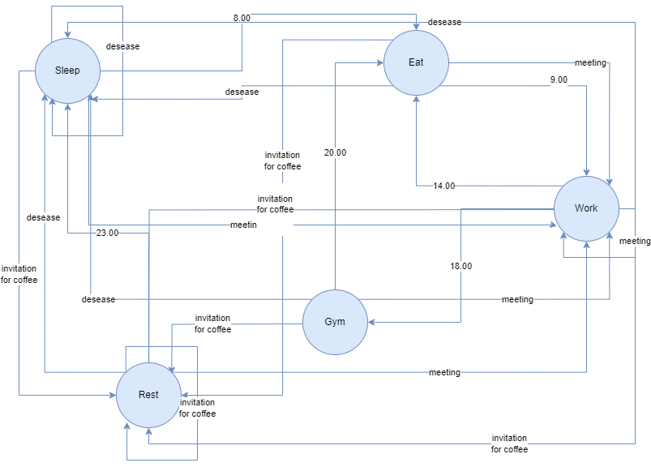
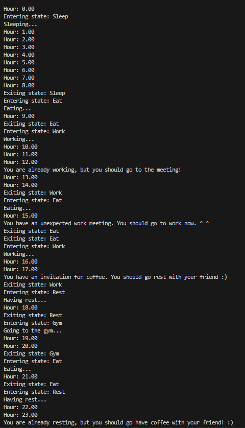

# StateMachine

In my version of the finite state machine, there are 5 possible states between which a transition occurs depending on the hour:
- Sleep()
- Eat()
- Work
- Gym()
- Rest()

They are are classes, that have such function as entry(), execute() and exit(), that are used to see what state we are in now.

There are also three random events ('a small deseaese', 'an invitation for coffee', 'an unexpected work meeting') that can also allow us to switch between states. Each time, the probability that a random event will occur is 20%.

For example: now we are working/studying (from 9am to 2pm), but a friend came, so we should get ready and go rest for an hour with a friend.

Here is a diagram of the transition between states:

And here are the example of a possible day:

